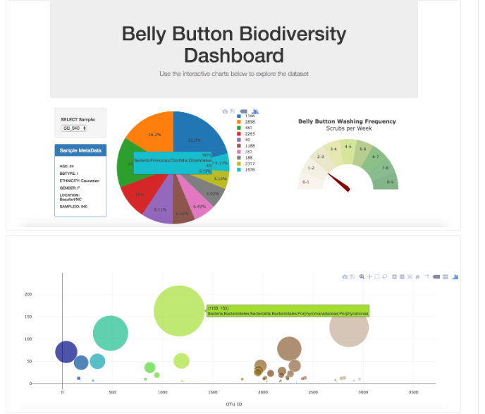

# Biodiversity-Interactive-Dashboard- 

# Background

he belly button is one of the habitats closest to us, and yet it remains relatively unexplored. In January 2011, we launched Belly Button Biodiversity to investigate the microbes inhabiting our navels and the factors that might influence the microscopic life calling this protected, moist patch of skin home. In addition to inspiring scientific curiosity, Belly Button Biodiversity inspired conversations about the beneficial roles microbes play in our daily lives.

Data: http://robdunnlab.com/projects/belly-button-biodiversity/

# Goals

Plotly.js
Use Plotly.js to build interactive charts for your dashboard.

Create a PIE chart that uses data from your samples route (/samples/<sample>) to display the top 10 samples.

Use sample_values as the values for the PIE chart

Use otu_ids as the labels for the pie chart

Use otu_labels as the hovertext for the chart

Display the sample metadata from the route /metadata/<sample>

Display each key/value pair from the metadata JSON object somewhere on the page

Update all of the plots any time that a new sample is selected.

You are welcome to create any layout that you would like for your dashboard. An example dashboard page might look something like the following.

Display the sample metadata from the route /metadata/<sample>

Display each key/value pair from the metadata JSON object somewhere on the page

Update all of the plots any time that a new sample is selected.

You are welcome to create any layout that you would like for your dashboard. An example dashboard page might look something like the following.

# Run Locally

Run this command git clone https://github.com/Piterbrito/Plotly.js--InteractiveDashboard/

Make sure you have installed in your computer all libraries used above 

Double check if you are in the right directory in you terminal ...that often cause errors

Terminal Should be addressed at folder: flask_app

Run the command: python app.py in your terminal

Copy the output link and paste in your Browser

You are now in the dev environment and you can play around

# Findings

Screeshot

